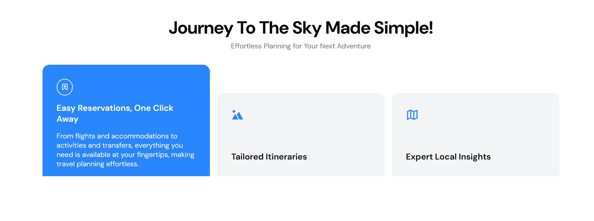

# Travel-Website 

## Description  
This project is a **fully responsive Travel Website** developed using **HTML** and **CSS**. It showcases a modern design that highlights **various travel destinations** and provides an intuitive browsing experience for users. The website is created to inspire travel enthusiasts with a visually appealing and user-friendly interface.  

## Special Features  
- **Responsive Design**: The website is optimized for all devices, ensuring a seamless browsing experience on desktops, tablets, and smartphones.  
- **Modern Aesthetics**: Features a clean and engaging design with visually striking layouts and appealing color schemes.  
- **User-Friendly Navigation**: Easy-to-use navigation to explore destinations and services effortlessly.  

## Application Screenshots  
 - 
 - 
 - 
 - 
 - 
 - 

## Usage  
To explore the Travel Website:  
1. Open the `index.html` file in any web browser.  
2. No additional setups or installations are required, making it **straightforward for users** to view the website and its features.  

## Installation  
There is no complex installation process involved. You can:  
1. Clone the repository from GitHub
2. Open the index.html file directly in your preferred web browser.
